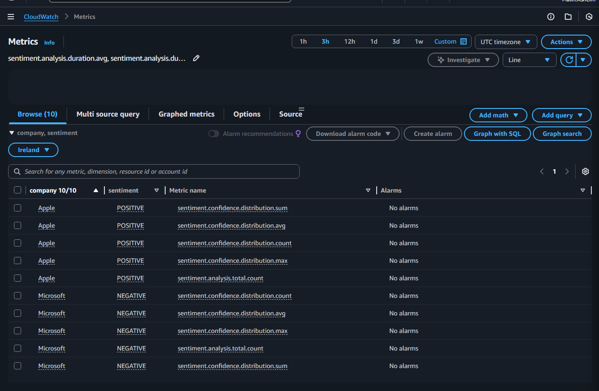
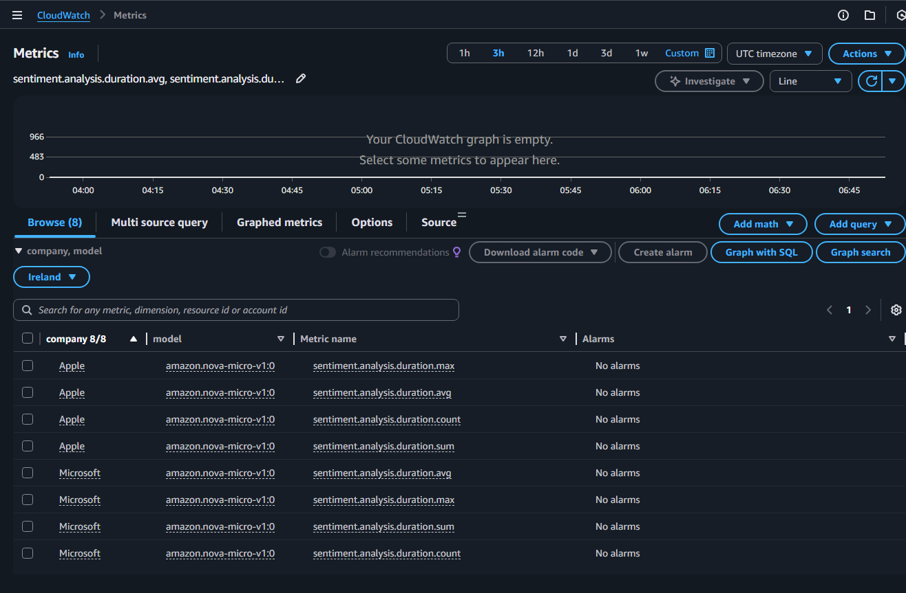
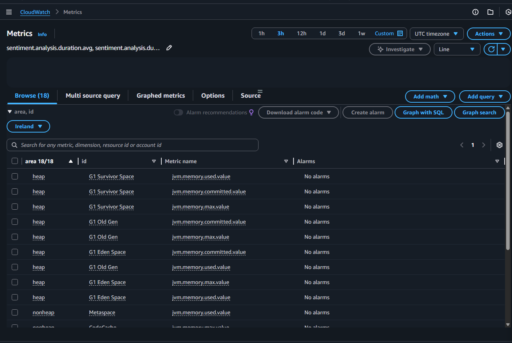
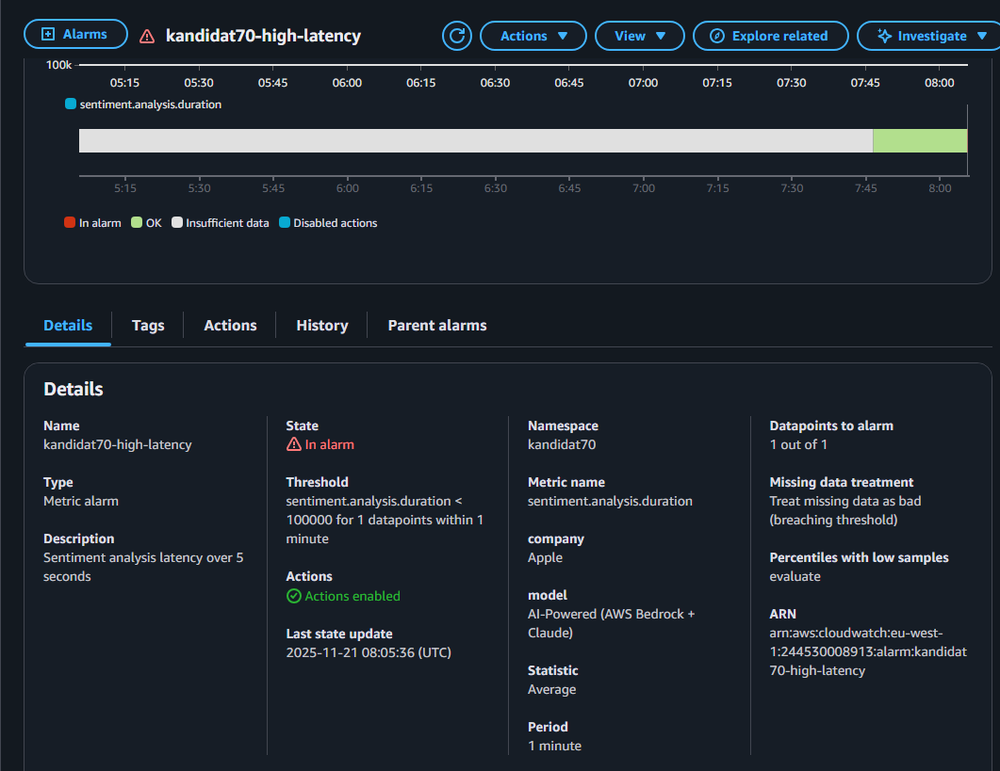
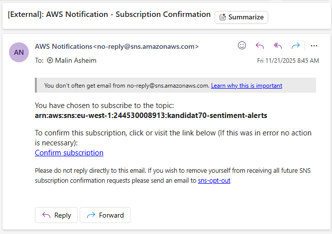
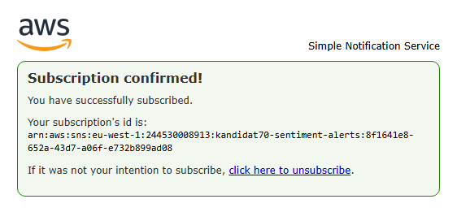
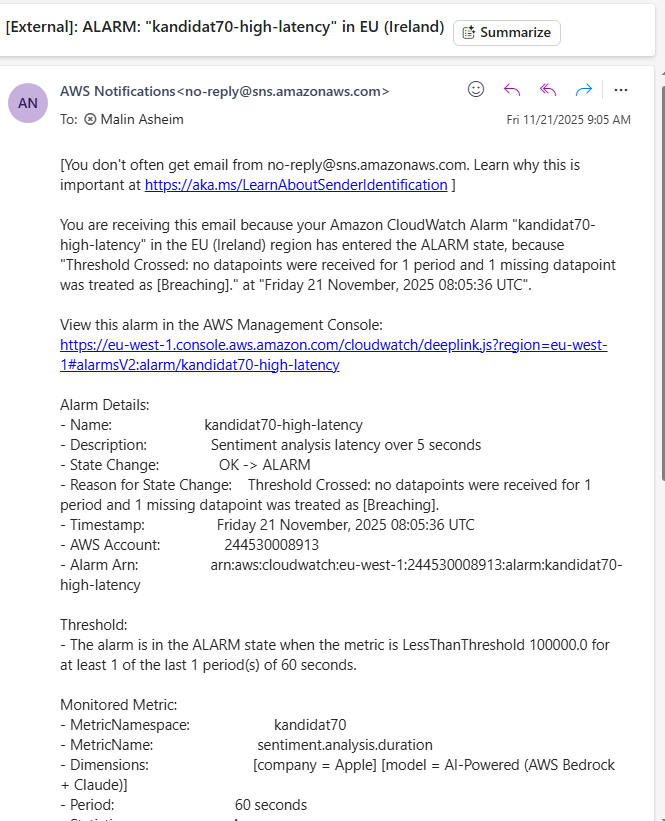

## Oppgave 1 – AWS Lambda, SAM og GitHub Actions
Jeg har opprettet en egen mappe `infra-s3/` der all Terraform-kode ligger. Terraform-konfigurasjonen oppretter en S3-bucket for analyseresultater med navnet kandidat-70-data.
Jeg har laget en lifecycle-policy som gjelder for filer under prefix midlertidig/, der filer flyttes til Glacier etter 7 dager og slettes etter 30 dager. Filer utenfor dette området påvirkes ikke. Alle verdier som navn, region og tidsgrenser er variabler for å unngå hardkoding.


## Oppgave 2 – AWS Lambda, SAM og GitHub Actions

### Del A – Deploy og test av SAM-applikasjonen

Jeg har tatt utgangspunkt i SAM-applikasjonen i `sam-comprehend/` og koblet den mot S3-bucketen fra oppgave 1.

---
### 1.
I sam-comprehend/ ligger en enkel SAM-applikasjon med:
- template.yaml
- sentiment_function/app.py
Dette gir et lite serverless API som analyserer tekst og lagrer resultatet i S3.

### 2. 
Endringer i `template.yaml`:

- Under `Globals` har jeg satt:
  ```yaml
  Globals:
    Function:
      Timeout: 30
      MemorySize: 256
      Runtime: python3.11
    Api:
      EndpointConfiguration: REGIONAL

Videre peker parameteren S3BucketName på min bucket: kandidat-70-data
Slik kan Lambda skrive resultatene direkte til S3-bucketen.

### 3.
Jeg kjørte applikasjonen med "sam build" og "sam local invoke"
Når Lambda kjører uten tekst-payload returnerer den en feilmelding:
{"error": "Text field is required"}
Dette viser at applikasjonen kjører lokalt med riktif kode og runtime

### 4.
Jeg deployet applikasjonen med "sam deploy --guided" og valgte: 
Stack name: kandidat-70-sam
Region: eu-west-1
S3BucketName: kandidat-70-data
IAM role creation: Yes
Endpoint type: REGIONAL

Dette resulterte i en vellykket deploy.

### 5.
Link til API: https://ohjnhpxou3.execute-api.eu-west-1.amazonaws.com/Prod/analyze/

Jeg testet med Postman ved å sende POST-req:
{
  "text": "Apple launches groundbreaking new AI features while Microsoft faces cloud security concerns."
}
Outputtet viste riktig sentimentanalyse fra Amazon Comprehend.

### Del B – Fiks GitHub Actions Workflow
Jeg har endret workflowen slik at den følger god DevOps praksis:

- På Pull Request kjøres kun:
  - `sam validate`
  - `sam build`
- På push til main kjøres:
  - `sam validate`
  - `sam build`
  - `sam deploy`

Hardkodede verdier er erstattet med kandidatnummer (70) og GitHub Secrets brukes for AWS-nøkler.

Jeg oppdaget at GitHub Actions brukte Python 3.9, mens Lambda var satt til python3.11. Dette førte til feil under sam build. Jeg løste dette ved å oppdatere workflowen til å bruke Python 3.11, som gjorde at byggingen fungerte korrekt.

Workflow-fil:
https://github.com/malinash/EksamenPGR301/blob/main/.github/workflows/sam-deploy.yml

Vellykket deploy (push til main):
https://github.com/malinash/EksamenPGR301/actions/runs/19558456996

PR-validering (uten deploy):
https://github.com/malinash/EksamenPGR301/pull/2

For at workflowen skal kjøre i sensor sitt repo må følgende secrets legges til:

AWS_ACCESS_KEY_ID

AWS_SECRET_ACCESS_KEY

CANDIDATE_ID

## Oppgave 3 – Container og Docker

### Del A
Jeg containeriserte Spring Boot-applikasjonen ved å lage en Dockerfile med multi-stage build (Maven + Java 21 for bygging og Amazon Corretto 21 Alpine for runtime). Containeren ble kjørt med nødvendige AWS-miljøvariabler og eksponerte port 8080.
Ble testet med POST-req til /api/analyze, og returnerte korrekt AI-basert sentimentanalyse fra AWS Bedrock.

### Del B
Workflow fil:
https://github.com/malinash/EksamenPGR301/actions/runs/19561732129

Jeg valgte å bruke to tags for Docker-imaget:

- `latest` – peker alltid på siste vellykkede build fra `main`. Dette gjør det enkelt å bruke imaget i f.eks. test- og demo-miljøer uten å måtte oppdatere tag hver gang.
- `sha-<commit>` (`sha-${GIT_SHA}`) – en unik tag per commit. Denne gjør det mulig å spore nøyaktig hvilken kodeversjon et image er bygget fra, og gjør rollback og debugging enklere hvis noe går galt i et senere deploy.

Kombinasjonen av `latest` + `sha-commit` gir både enkel bruk og god sporbarhet.

For at `.github/workflows/docker-build.yml` skal fungere i en fork, må sensor:
Legge inn secrets:
  - `DOCKER_USERNAME` = Docker Hub-brukernavn
   - `DOCKER_TOKEN` = Docker Hub access token

Workflowen vil da automatisk pushe til:
<DOCKER_USERNAME>/sentiment-docker:latest

## Oppgave 4 – Observabilitet, Metrikksamling og Overvåkningsinfrastruktur

### Del A
Jeg har implementert egendefinerte metrikker i applikasjonen ved hjelp av Micrometer og eksportert disse til Amazon CloudWatch under namespace kandidat70.

Følgende metrikker er implementert:

Counter – sentiment.analysis.total
Teller totalt antall sentimentanalyser per selskap og sentiment-type. Counter er valgt fordi verdien kun skal øke.

Timer – sentiment.analysis.duration
Måler varigheten på en sentimentanalyse. Timer er valgt for å analysere ytelse, responstid og maks-/gjennomsnittsverdier.

Gauge – sentiment.companies.detected.last
Viser antall selskaper funnet i siste analyse. Gauge er valgt fordi verdien kan gå både opp og ned mellom hver kjøring.

DistributionSummary – sentiment.confidence.distribution
Måler fordelingen av confidence-scorer (0–1) for sentimentanalysene. Dette gir innsikt i hvor sikker modellen er over tid.

### Cloudwatch - Counter + DistributionSummary


### Cloudwatch - Timer


### Cloudwatch - Gauge



### Del B

### Dashboard Cloudwatch

### Alarm i konsoll


### Epost 





## Oppgave 5 – KI-assistert Systemutvikling og DevOps-prinsipper

Kunstig intelligens har på kort tid blitt et viktig verktøy i programvareutvikling. Verktøy som ChatGPT, GitHub Copilot og Claude kan generere kode, foreslå løsninger, skrive tester og hjelpe med feilsøking.Dette påvirker ikke bare hvordan programvare bygges, men også hvordan utviklingsprosessen fungerer i en DevOps-kontekst. DevOps er basert på prinsippene flyt, feedback og kontinuerlig læring og forbedring. I denne drøftingen vurderes hvordan KI-assistert utvikling både kan styrke og utfordre disse prinsippene, med utgangspunkt i egne erfaringer fra arbeid med AWS, Terraform og observabilitet.

Et hovedmål i DevOps er rask og stabil levering av verdi fra idé til produksjon. KI-verktøy kan bidra betydelig til økt hastighet i utviklingsprosessen. For eksempel kan en utvikler bruke KI til å generere utkast til Terraform-konfigurasjoner, Java-klasser eller Spring Boot-konfigurasjon på sekunder, noe som normalt ville tatt mye lengre tid.
Samtidig kan KI også skape nye flaskehalser. Generert kode må alltid kontrolleres manuelt, og hvis man ikke forstår koden godt nok selv, kan det ta lang tid å validere at den faktisk fungerer og følger prosjektets arkitektur. I verste fall kan utvikleren bli avhengig av KI på en måte som senker tempoet når verktøyet gir feil eller misvisende forslag. Dette kan føre til flere iterasjoner før man kommer frem til en fungerende løsning som kan dermed skape en lenger utviklingsprosess i lengden. 
Når det gjelder code review og deployment, kan KI-generert kode føre til større mengder kode som må gjennomgås, noe som potensielt kan bremse prosessen. På den positive siden kan KI også foreslå alternative eller mer effektive løsninger, som kan forbedre kvaliteten på koden før deploy.

Rask og tydelig feedback er avgjørende i DevOps. Når KI er involvert i kodeproduksjonen, øker behovet for gode feedback-mekanismer. Automatisert testing, overvåkning og metrikker blir enda viktigere for å oppdage feil i tid. I denne eksamenen brukte jeg CloudWatch-metrikker og alarmer for å overvåke responstid og antall analyser. Dette kan sees som en del av en feedback loop som raskt avslører om noe fungerer eller ikke, uavhengig av om koden er skrevet av menneske eller KI.
En utfordring er at KI kan generere kode som ser riktig ut, men som inneholder skjulte feil eller sikkerhetssårbarheter. Derfor er det viktig med tidlig tilbakemelding gjennom enhetstester, integrasjonstester og overvåkningsverktøy. Uten dette kan feil bli oppdaget først i produksjon, noe som bryter med DevOps-prinsippet om tidlig feedback.
Samtidig kan KI også brukes positivt i feedback-prosessen. For eksempel kan KI analysere logger, testresultater eller metrikker og komme med forslag til forbedringer. Dermed kan KI bidra til raskere læring og justering i utviklingsløpet.

Kontinuerlig læring og forbedring er viktig i DevOps-kultur. KI-assistenter kan være et effektivt læringsverktøy, spesielt for studenter og juniorutviklere. Når jeg jobbet med Terraform og CloudWatch, kunne jeg stille konkrete spørsmål og få forklaringer på konsepter jeg ikke fullt ut forstod. Dette bidrar til raskere kompetanseutvikling.
På den andre siden finnes det en risiko for at utviklere blir for avhengige av KI og slutter å tenke selv. Hvis man alltid ber KI om å løse problemer, mister man gradvis evnen til å analysere og løse dem selv. Over tid kan dette føre til en redusert helhetsforståelse. Derfor må KI brukes som et støtteverktøy og ikke en erstatning for egen kompetanse.
Organisasjoner må også tilpasse måten de deler kunnskap på. Når kode ofte genereres av KI, blir det ekstra viktig å dokumentere hvorfor løsninger er valgt, og hva som faktisk skjer i systemet. Nye ferdigheter blir også viktige: å kunne skrive gode prompts, evaluere KI-generert kode kritisk, og kombinere menneskelig dømmekraft med KI sine raske forslag.

KI-assistert utvikling har stort potensial til å forbedre flyt, styrke feedback og støtte kontinuerlig læring i DevOps. Samtidig introduserer det nye risikoer knyttet til kodekvalitet, avhengighet og manglende forståelse. Etter min mening så bør KI brukes som et godt støtteverktøy, men i kombinasjon med menneskelig innsikt. Dette innebærer kritisk tenkning og gode DevOps praksiser som testing, overvåkning og samarbeid. Brukt riktig kan KI bli en viktig del av fremtidens DevOps miljø. På den andre siden, brukt feil så kan det svekke både kvalitet og kompetanse.


